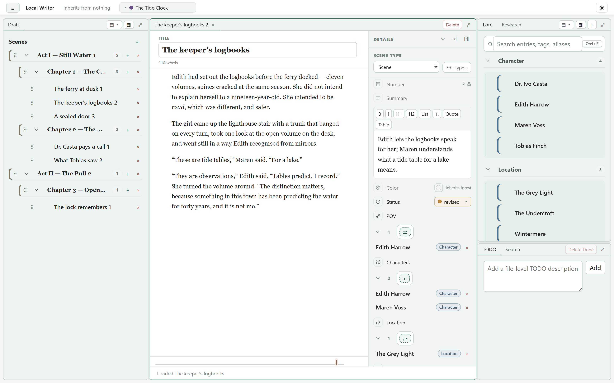
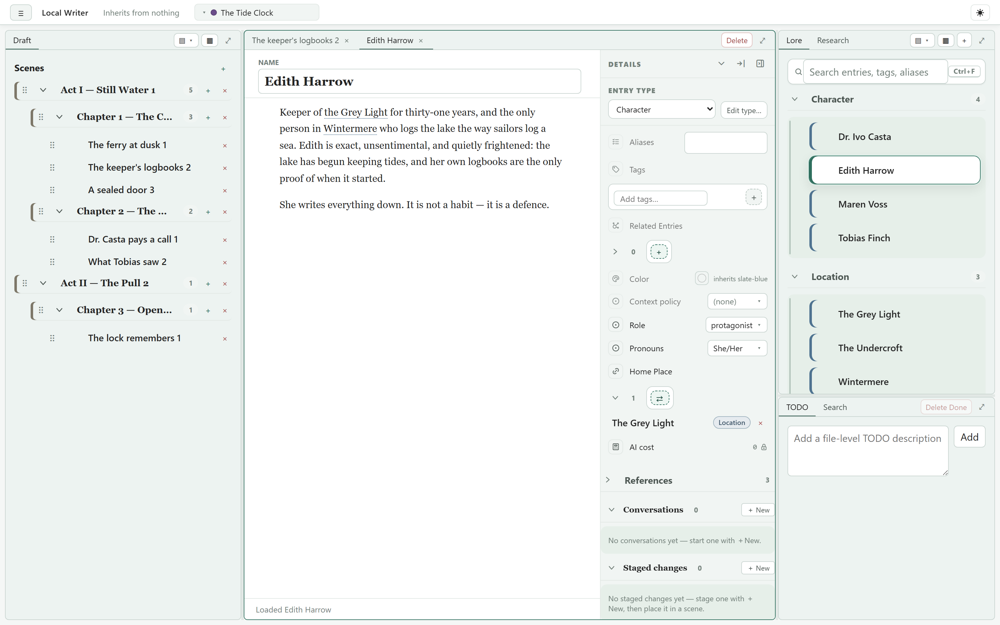
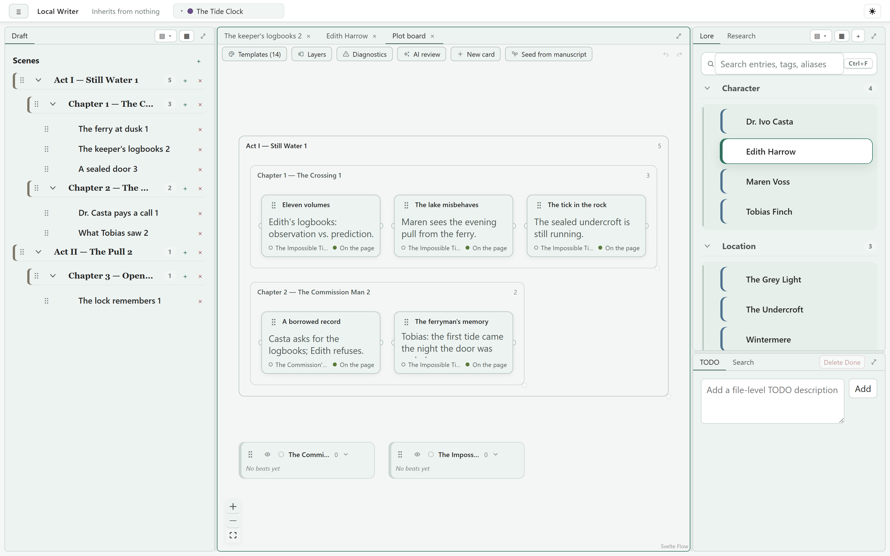

# Local Writing App

A fiction-writing app that runs entirely on your own machine, stores your work as
plain files you can read without it, and treats AI as an optional tool you point
at your prose — not a service you rent. No account, no subscription, no sync —
nothing phones home.



## Getting it

Installers for **Windows, macOS, and Linux** are on the
[latest release](https://github.com/antoncl/local-writing-app/releases/latest) —
download, run, write. Prefer to build it yourself, or curious how it's put
together? → [Running from source](docs/running-from-source.md).

There's also a [website](https://antoncl.github.io/local-writing-app/) — the
same pitch in nicer clothes, fit for sharing.

## Why

**I'm opposed to everything having to be a paid subscription.** Writing software
has drifted into rented access to your own manuscript — stop paying and you're
locked out of work you did. This app is a program you run. If the project is
abandoned tomorrow, the copy on your disk keeps working, and the license lets
anyone pick it up.

**I want the ability to work completely offline.** Files on disk are the source of
truth — Markdown with YAML front matter, plus a handful of YAML files for
structure. Everything else (`.cache/`, indexes) is rebuildable. AI is off by
default and, when you do enable it, [Ollama](https://ollama.com) is a first-class
provider, so the whole app — prose, lore, chat, prompts — can run on a laptop
with the network switched off.

**I think this is the right way to integrate AI into the writing process.** Not a
"write my novel" button. The model gets structured context you authored — the
lore entries, the scenes, the outline — assembled through prompts *you* wrote and
can read. You choose the provider and model per task, you see the token cost of
every call, and the permission model fails closed. It's a research assistant and
a sparring partner sitting next to your manuscript, not a ghostwriter that owns
it.

## What it does

**Manuscript.** A tree of acts, chapters, and scenes with drag-reordering. Scenes
are Markdown files edited in a WYSIWYG editor; the front-matter `id` is the
canonical identity, so renaming files never breaks anything.

**Lore.** Entries with types, tags, aliases, references, and Markdown bodies, plus
backlinks. Mid-scene *mutations* let a fact change partway through the story, with
a timeline and scrubber showing the effective state at any point.



**Plot boards.** Plotlines and cards laid out against the manuscript, so
structure is something you can see and rearrange rather than just imagine.



**Layered metadata schema.** The app ships a minimal built-in schema, then merges
every `metadata.schema.yaml` from your projects base folder down to the open
project — nearer folders override farther ones. You model world / series / book
levels purely by folder depth; the app doesn't hardcode those concepts. Node
types, fields, and their inheritance are authored in-app.

**Views.** Every list in the app is backed by a *view* — a small set-algebra query
(union, intersection, difference, complement, plus relational `nest`/`match` over
lore links) authored in a drag-and-drop node-graph designer. Views are saved as
nodes, can take parameters, and drive grouping and trees.

**AI, when you want it.** Providers: Anthropic, OpenAI, OpenRouter, and Ollama for
local models. Prompts are Jinja2 templates stored as project files, with declared
inputs including a context picker that constrains what a prompt may pull in. Chat
sessions are nodes like everything else. Implicit context detects entities in
what you actually wrote and offers them. Per-call token and cost accounting rolls
up to a project total.

**Also:** research notes with their own tree, project- and scene-anchored TODOs,
tags, full-project search, an assistant roster, and a saveable pane layout.

Deliberately absent: export to Word/PDF/EPUB, collaboration, cloud sync.

## Project format

A project is a folder:

```text
project.yaml              # manifest: title, AI policy, UI preferences
project.md                # the project node itself
manuscript.structure.yaml # act/chapter/scene ordering
research.structure.yaml
metadata.schema.yaml      # this layer's schema contributions
tags.yaml
todo.yaml
ai_invocations.csv        # append-only AI call log and costs
scenes/ lore/ prompts/ research/ chats/ views/
.cache/                   # disposable, always rebuildable
```

Scenes and lore entries are Markdown with YAML front matter. You can read, grep,
diff, and version-control the whole thing without this app. API credentials are
*not* stored in the project — they live in per-machine config, so a project
folder is safe to commit or share.

## Status

Pre-1.0 and moving. It's the app I write in, so it's stable in the paths I use
daily and rougher at the edges. Since 0.9.5, storage-format changes migrate
your projects forward — your data is meant to last. Issues and milestones on
GitHub are the real backlog.

## License

MIT — see [LICENSE](LICENSE). Do what you like with it.
