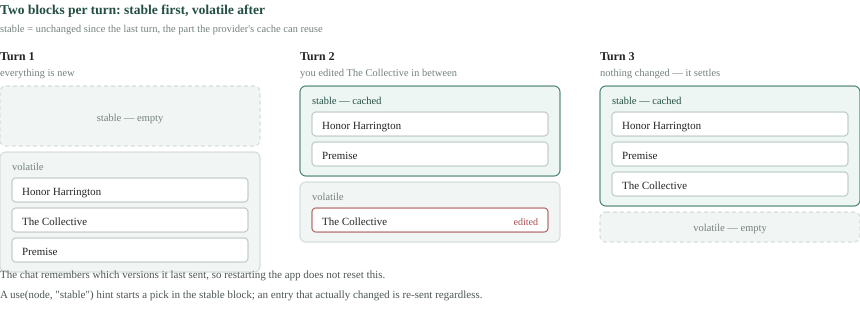

# What the AI sees

> User guide. Every chat turn sends the model your prompt, the conversation so
> far, and a block of lore the app chose for you. This guide is about that
> block — what goes into it, why, and the few places you steer it.
> It's automatic by default; the last sections are the parts you can touch.

You never paste your world into a prompt by hand. A prompt *names* what the model
should know about, and the app fetches the entries, removes duplicates, fits them
to a size, and places them where the model's cache can hold on to them. Here is
what happens between your message and the model, in the order it happens.

## Two halves: what you named, and what the app noticed

The lore in a turn comes from two sources, and one switch decides whether the
second one runs at all.

- **Declared** — what you named. A prompt's own picks (`use()`, usually fed by a
  **Lore** picker), the entries the scene itself references in its fields (its
  point-of-view character, its location), and every entry whose **Context policy**
  is *Always include*. These are sent whole, every turn. Nothing trims them.
- **Automatic** — what the app noticed. Entries named in your message, in the
  prompt, or in the scene's prose, plus a short reach out from those. This half is
  fitted to a budget on the assistant, so a big world doesn't swamp a turn.

The switch is the prompt's `auto_lore()` call. A prompt that calls it gets both
halves; the Context door shows **lore-enabled · by this prompt** at the top of its
System section. A prompt that only picks — `use()` alone — sends its picks and
nothing else: no scene references, no always-included entries, no noticing. That is
deliberate. A prompt built to check *one* entry should not be handed the world.

A prompt can also place an entry as it was at an earlier snapshot, alongside the
entry as it is now — `use(node, snapshot=id)`. Propose's built-in **Follow a
change** does this for the entry that changed, so you see what changed without
re-reading two renders yourself. The earlier state rides the stable tier every
turn, like a declared pick, so it survives the conversation-history window even
many turns later.


## What automatic lore notices

Noticing is a name match. The app builds one matcher from every entry's **Name**
and **aliases** — the same detection that underlines mentions while you write
(see [Lore](#guide:lore), *Mentions in your prose*) — and runs it over three
surfaces on every turn:

1. **Your latest message.** Name a character and they come along.
2. **The prompt itself**, once, on the first turn. If your template's text names an
   entry, it's noticed as part of setting the scene.
3. **The scene's prose** — its body and every long-text field on it, such as a
   summary. A chat that isn't anchored to a scene has no third surface.

Italics don't hide a name; `_The Implant_` is noticed like `The Implant`. Titles
and short fields are not scanned — only prose.

From what it noticed, the app reaches **one step out**, in two ways:

- **Through prose.** Each noticed entry's own body and long-text fields are scanned
  once for more names. What that finds is not scanned again; the reach stops at
  one step, so a heavily cross-referenced world can't cascade.
- **Through links.** Each noticed entry's reference fields — its faction, its
  home, the members of a group — are followed once.

The scene's own references and the always-included entries reach out the same
way. A prompt's pick does not: picking an entry brings that entry, not its
neighbours. If a pick is *also* named in your message, it is a noticed entry too
and reaches out like one.


## Two settings on the assistant

Both settings shape the automatic half only. Picks, scene references and
always-included entries are never counted against them.

- **Lore reach** — *One hop* (the default) or *Named only*. *Named only* keeps
  what was actually named in the message, the prompt or the scene, and drops the
  step out through prose and links. The Context door still lists what the prose
  step noticed; it just isn't sent.
- **Lore budget (tokens)** — the ceiling on the automatic half, whole entries
  only. Leave it blank for the default of 16 000. Set it to **0** to send the
  declared half alone, whatever the prompt calls.

When the noticed entries don't all fit, the app keeps them in the order of how
close they are to your own words: entries from **your message** first, then the
**prompt**, then the **scene's prose**, then the step out **through prose**, and
the step out **through links** last. Within a source, the most recently noticed
comes first. So the entries the budget drops first are the neighbours-of-neighbours,
never the character you just named. The door's **Left out** section shows exactly
what didn't fit, and you can open each one to see what the model would have got.


## One setting on the entry

Every lore entry has a **Context policy** field with one of four values:

- **Automatic (alias match)** — the default. Noticed when named, followed when
  linked, available to pickers.
- **Always include** — in every turn that has automatic lore on, named or not.
  Use it for the handful of entries that define your world: the premise, the
  magic system, the tone sheet.
- **Manual only** — never noticed, never followed as a link; sent only when a
  prompt picks it or the scene references it. Good for spoilers and notes to
  yourself that a stray name shouldn't pull in.
- **Never include** — kept out of every turn, even if a prompt picks it.

## How it's placed, and why that saves you money

Whatever the two halves produced is one set, each entry once, rendered as
compact XML. It is then split into two blocks for the turn:

- **Stable** — entries unchanged since the last turn of this chat.
- **Volatile** — entries that are new this turn, or that you edited since.

The stable block goes first, so a provider that caches prompt prefixes reads it
from cache instead of billing it again. An entry you edit moves to the volatile
block for one turn and settles back once the app has seen the new version; the
door marks such an entry **edited** until then. Restarting the app doesn't reset
this: the chat remembers which versions it last sent.

A prompt can nudge where a pick starts — `use(node, "stable")` or
`use(node, "volatile")` — but a hint never overrides the check: an entry that
actually changed is re-sent whatever its hint says.



## Reading the Context door

The door on a chat's composer is the honest version of everything above, before
the first send and after every turn:

- **System** — the rendered prompt, with **lore-enabled · by this prompt** when
  the automatic half is on.
- **Stable lore / Volatile lore** — the two blocks with their entries. Open an entry
  to see the exact XML the model receives. Rows present with no *lore-enabled*
  line means "picks placed, automatic off". An earlier state placed by
  `use(node, snapshot=id)` appears first in the stable tier's list, as an "as of
  ⟨time⟩" row; the tier row's count includes it as an earlier state.
- **Auto-added this conversation** — the noticed entries, each with where it was
  noticed and on which turn.
- **Left out** — what the budget dropped this turn.
- **Inputs (locked)** — the picks and other inputs the chat was started with.

## In your prompts

Three calls cover it. All three print nothing where you write them.

```jinja
   {# the entries a Lore picker chose — declared #}
{{ auto_lore() }}           {# turn the automatic half on #}
  {# a ready-made optional Lore picker, picks only #}
```

`auto_lore()` was called `use_lore()`; the old name still works until 1.0 but
adds a warning to every estimate, so rename it when you see one. A prompt that
calls neither sends no lore at all — the model sees only your text and the
conversation. Details of the calls are in [Writing prompts](#guide:writing-prompts)
and the [Prompt reference](#guide:reference); the picker input itself is its own
guide, [Context picker](#guide:context-picker).
