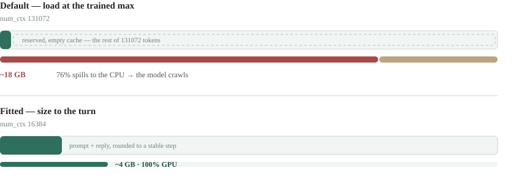
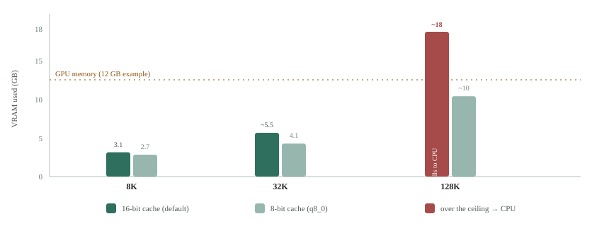

# Ollama context

> User guide. How the app fits your local models into their context window — why a
> chat that should be light can make Ollama slow, what the app does about it, and
> the one setting worth tuning yourself. It's all automatic; the last section is
> the part you can touch.

Running a model locally through **[Ollama](https://ollama.com)** is the private,
offline heart of this app — but a local model treats its context differently from
a cloud one. Left to its defaults, a two-line question can reserve gigabytes of
memory and drag a fast machine to a crawl. Here's what's happening, and why you
mostly don't have to think about it.

## Two numbers people mix up

Almost every confusion here comes from running two different numbers together.

- **Context length** — the largest window the model was *trained* to handle. It's
  baked into the model file (Ollama reads it as `context_length`): Llama's is
  128K tokens, Qwen's 256K. A fixed ceiling. You don't set it, and it's the same
  every time you load the model.
- **`num_ctx`** — how much of that ceiling you actually *switch on* for a given
  load. Ollama reserves a working memory (its "KV cache") for exactly this many
  tokens — so **`num_ctx` is the memory cost.** Leave it unset and it fills the
  whole ceiling; size it down and you reserve only what the turn needs.

The trouble isn't the model's 128K context length — that's just its capacity.
It's that **`num_ctx` defaults to the same 128K**, whether the chat needs it or not.

## The problem: the default reserves everything

Ask a 128K model a short question and Ollama still loads it at the full 128K. The
prompt fills a sliver; the rest is empty cache holding a place for tokens that
never arrive. On a measured run, one Llama model at `num_ctx 131072` claimed about
**18 GB** and ran **76% on the CPU** — where a model runs slowly. Sized to the turn
(`num_ctx 8192`), the same model took **3.1 GB** and stayed entirely on the GPU.



It's worth being clear: this isn't the model getting *cut off*. Nothing is lost.
It's an empty reservation the size of the whole trained window, sitting in memory
your machine can't spare.

## What the app does about it

Every Ollama turn goes through four steps. The first three are automatic for every
local assistant; the fourth is a switch you flip when a chat runs long.

1. **Discover** the model's real trained window, read from its file — no cost, no
   loading the model to find out.
2. **Size** `num_ctx` to the turn: the prompt plus room for the reply, rounded up
   to a stable step, and never above the model's window.
3. **Clamp the reply**: a local reply is capped at a sensible length by default
   (about 8K tokens, not 32K), so the reservation stays small.
4. **Window the history** (optional): keep a long conversation from pushing your
   most important context out of the window.

Rounding to a step matters: changing `num_ctx` makes Ollama reload the model, so a
size that drifted token-by-token would reload it every message. Snapping to a step
means the size only changes when a chat crosses a boundary — a few reloads over a
long session instead of one per turn. A typical turn lands around **16K**,
comfortably on the GPU.

## The history window: keep the system prompt, drop old turns

This is the one to understand, because it prevents a quiet, expensive failure.

A conversation grows every turn. Eventually it outgrows even the sized window, and
something has to give. Ollama's own answer is to **truncate from the front** — and
the front is exactly where your system prompt and lore sit. The model silently
loses the instructions and world you gave it, with no warning.

The history window flips which end gives. It drops the **oldest whole exchanges**
instead, keeping the system prompt, the lore, and your current message intact.


You turn it on per assistant, with the **History budget (tokens)** field. Leave it
**blank** and nothing changes — the whole conversation is sent, exactly as before.
Set a token cap and the oldest exchanges are dropped first; a question is never
split from its answer, and your current message is always sent. When a send drops
older turns, the assistant's reply shows a quiet note — *"history 12.4k/16k · 3
earlier exchanges dropped"* — so the model's memory never shortens silently.

## Tuning it yourself

Almost all of the above is automatic. Three levers are yours when you want them —
two on each assistant, one on Ollama itself.

- **Max output tokens** (on the assistant) — how long a single reply may run.
  Defaults to a generous scene (~8K tokens); raise it if you want longer replies
  in one turn, and the window grows to fit. Blank uses the default.
- **History budget (tokens)** (on the assistant) — the history window above. Blank
  sends the whole conversation; a number caps it, protecting the system prompt and
  lore. Reach for it once a chat runs long on a small local model.
- **The KV cache precision** (on Ollama) — right-sizing changes *how many* tokens
  the cache holds; this changes *how many bytes each token costs*. By default it's
  16-bit. Dropping it to 8-bit halves the cache, at a quality cost most people
  can't detect. It's an Ollama **server** setting — an environment variable where
  you launch `ollama serve`, not a field in the app:

```
# recommended — halves the KV cache, near-invisible quality cost
OLLAMA_KV_CACHE_TYPE=q8_0  ollama serve

# aggressive — quarters it, but lossier; worst on high-GQA models like Qwen
OLLAMA_KV_CACHE_TYPE=q4_0  ollama serve
```

Sizing is the big lever; precision is the fine one. Moving a chat from 128K down to
8–32K is what gets you off the CPU in the first place — the app does that for you.
Quantizing the cache then roughly halves what's left, and it matters most at large
contexts, where the cache is actually full.



The figures above are measured on a Llama-family model; your exact numbers vary by
hardware and architecture. The shape is what holds: right-sizing keeps you on the
GPU, and 8-bit precision buys headroom at the top end.

---

Provider setup lives in **[Turning on AI](#guide:ai-setup)**; how the app chooses
what world and history to send is **[Context picker](#guide:context-picker)**.
